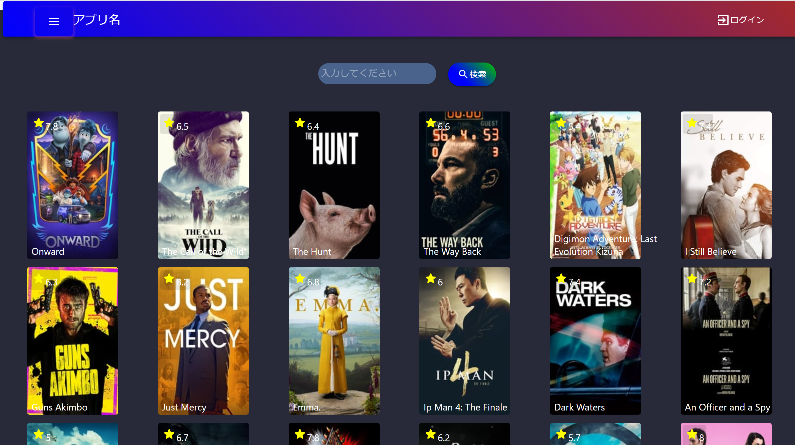

1. タイトル

React Hooksを用いた映画アプリ

2. デモ


デモは[こちら](https://ezure-haruna.github.io/Movie-App/)

3. プロジェクトの概要説明
- メニューバーから人気映画・上映中の映画を見ることができます。
- 気になる映画の検索も可能です。
- 映画の画像をクリックすると、映画の概要などの詳細欄に飛ぶことができます。
- 詳細欄から映画をお気に入り追加することができます。お気に入りした映画のリストはメニューバーから確認することができます。

4. 使用言語, 環境, テクノロジー
- React/React Hooks
- HTML/CSS
- material-UI
- デプロイ
- APIによるデータ取得

5. 使い方
```markdown:clone
 git clone https://github.com/Ezure-HARUNA/Movie-App
```


